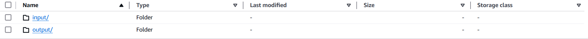
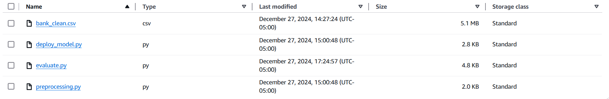
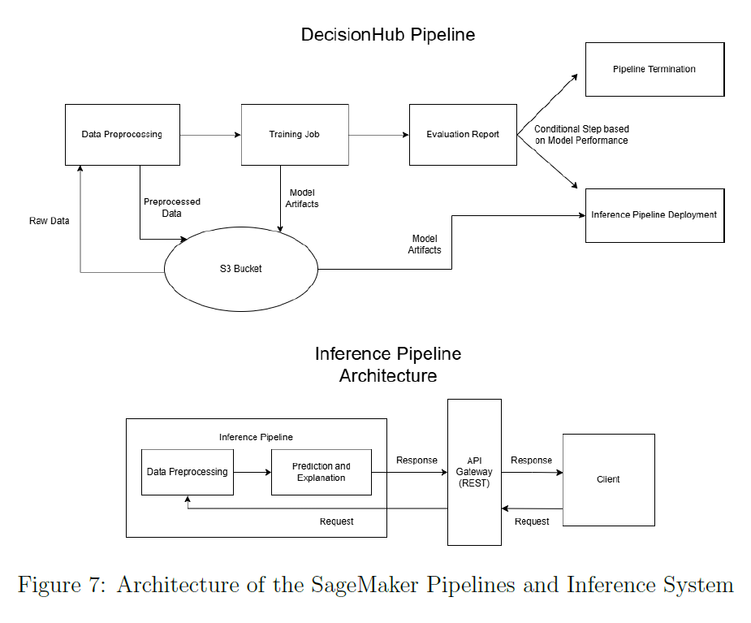

# End-to-End Machine Learning Pipeline on AWS

This repository demonstrates an end-to-end machine learning pipeline implementation on AWS, featuring an inference pipeline. In this pipeline, input requests are preprocessed and passed to the model for predictions in a single workflow, eliminating the need for a Lambda function. The pipeline incorporates scripts stored in an Amazon S3 bucket and executed locally within a JupyterLab environment hosted on a SageMaker Notebook instance.

This pipeline is also utilized in corporate environments, handling high-traffic domains effectively, showcasing its robustness and scalability for real-world applications.

---

## Before You Begin

Before setting up the pipeline, ensure the following:

1. **SageMaker Permissions**:  
   - The AWS account must have sufficient permissions for SageMaker. Full access to SageMaker services is recommended during setup.

2. **S3 Permissions**:  
   - The account must have permissions to access and manage S3 buckets.

3. **Create a Bucket**:  
   - Create an S3 bucket to store all inputs and outputs.  
     

4. **Create Input and Output Folders**:  
   - Inside the S3 bucket, create two folders: `input` and `output`.  
     

5. **Upload Data and Scripts**:  
   - Place the following files in the `input` folder:  
     - **Data**: `Bank_clean.csv`  
     - **Scripts**: `deploy_model.py`, `preprocessing.py`, `evaluate.py`  
     

---

## Pipeline Overview

The pipeline automates the following stages of a machine learning workflow:

1. **Data Preprocessing**:  
   - Preprocess raw data for training.

3. **Model Training**:  
   - Train a machine learning model on the prepared dataset.

4. **Evaluation**:  
   - Evaluate the trained model to ensure it meets performance requirements.

5. **Conditional Workflow**:  
   - Use a dynamic step to decide subsequent actions based on evaluation metrics.

6. **Deployment**:  
   - Deploy the model for real-time inference in a single pipeline without requiring a Lambda function.

---

## Pipeline Architecture

The pipeline leverages the following AWS services:

- **Amazon S3**:  
  - Stores raw data, scripts, and intermediate outputs.

- **SageMaker Notebook**:  
  - Hosts JupyterLab for executing local scripts and orchestrating the pipeline.

- **AWS Step Functions**:  
  - Manages the workflow steps with conditional logic for decision-making.

- **SageMaker Training**:  
  - Executes training jobs using the provided training script.

- **SageMaker Endpoints**:  
  - Deploys the model for real-time inference.

---

## How to Use

Follow these steps to execute the pipeline:

1. **Open the Notebook**:  
   - Open the `e2e-inference-pipeline-stable-v2.ipynb` notebook in your SageMaker Notebook instance.

2. **Initialize the Pipeline**:  
   - Ensure that the S3 bucket name and data file paths are correctly initialized in the notebook.

3. **Run the Notebook**:  
   - Execute all cells in the notebook to create and execute the pipeline instance.

4. **Monitor the Pipeline**:  
   - View and monitor the pipeline instance in SageMaker Studio under the "Pipeline" section.

---

## Contact

For questions or feedback, please reach out at [d.shahzad@mail.utoronto.ca].
